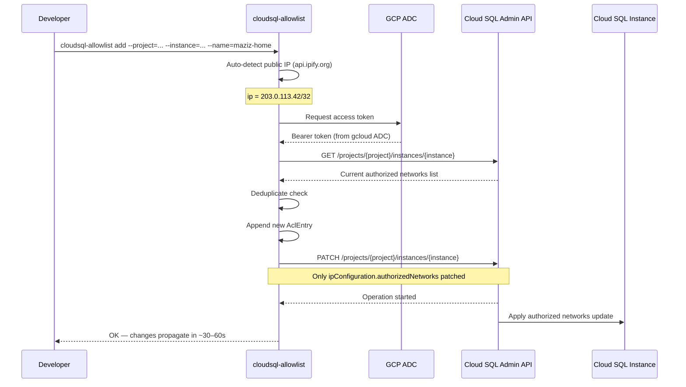

# cloudsql-allowlist

[](https://go.dev/)
[](https://cloud.google.com/sql)
[](https://cloud.google.com/sql/docs/mysql/admin-api)
[](LICENSE)

**Manage Cloud SQL authorized networks from the command line.**

Add, remove, or list developer IP addresses on a Cloud SQL instance in one command — no GCP Console clicks, no manual JSON editing. Built for teams where developers need quick access to test/staging databases from dynamic IPs.

---

## The Problem It Solves

In my 12 years managing enterprise infrastructure across the UAE and Egypt, the most common developer request I get is: *"I need access to the staging database from home today."*

The manual process: open GCP Console → Cloud SQL → instance → Connections → Authorized networks → Add → type the IP → Save → wait 30-60 seconds. Repeat every time the developer's IP changes. For a team of 10, this is 30 minutes of DevOps time a week.

`cloudsql-allowlist` turns that into one command that takes 5 seconds.

---

## Architecture



---

## Quick Start

### 1. Prerequisites

```bash
# Install Go 1.22+
# https://go.dev/dl/

# Authenticate with GCP
gcloud auth application-default login
```

### 2. Install

```bash
git clone https://github.com/maziz00/cloudsql-allowlist.git
cd cloudsql-allowlist
go build -o cloudsql-allowlist .

# Optional: install to PATH
sudo mv cloudsql-allowlist /usr/local/bin/
```

### 3. Use It

```bash
# Add your current IP (auto-detected)
cloudsql-allowlist add \
  --project=my-gcp-project \
  --instance=staging-db \
  --name=maziz-home

# Add a specific IP or CIDR
cloudsql-allowlist add \
  --project=my-gcp-project \
  --instance=staging-db \
  --name=office-vpn \
  --ip=203.0.113.0/24

# List all authorized networks
cloudsql-allowlist list \
  --project=my-gcp-project \
  --instance=staging-db

# Remove an entry by name
cloudsql-allowlist remove \
  --project=my-gcp-project \
  --instance=staging-db \
  --name=maziz-home
```

---

## Command Reference

### `add` — Authorize an IP

```
cloudsql-allowlist add [flags]

Flags:
  --project    GCP project ID                          (required)
  --instance   Cloud SQL instance ID                   (required)
  --name       Label for this entry, e.g. 'maziz-home' (required)
  --ip         IP or CIDR to authorize                 (auto-detects if omitted)
  --dry-run    Preview the change without applying it
```

**IP handling:**
- `--ip` omitted → auto-detects your current public IP via `api.ipify.org`
- Plain IP (e.g. `203.0.113.42`) → `/32` appended automatically
- CIDR (e.g. `10.0.0.0/8`) → used as-is
- Duplicate IPs are detected and skipped — no duplicates added

### `remove` — Revoke an IP

```
cloudsql-allowlist remove [flags]

Flags:
  --project    GCP project ID         (required)
  --instance   Cloud SQL instance ID  (required)
  --name       Label to remove        (required)
  --dry-run    Preview without applying
```

### `list` — Inspect current allowlist

```
cloudsql-allowlist list [flags]

Flags:
  --project    GCP project ID         (required)
  --instance   Cloud SQL instance ID  (required)
```

**Example output:**

```
NAME          IP / CIDR          KIND
----          ---------          ----
maziz-home    203.0.113.42/32    sql#aclEntry
office-vpn    203.0.113.0/24     sql#aclEntry
ci-runner     35.186.0.0/20      sql#aclEntry

Total: 3 authorized network(s) on my-gcp-project/staging-db
```

---

## Authentication

This tool uses [Application Default Credentials (ADC)](https://cloud.google.com/docs/authentication/application-default-credentials) — the same mechanism used by the GCP SDK and `gcloud`.

```bash
# For local development
gcloud auth application-default login

# For CI/CD — set the environment variable
export GOOGLE_APPLICATION_CREDENTIALS=/path/to/service-account-key.json

# For GCP VMs (GCE, Cloud Run, GKE) — no setup needed
# The attached service account is used automatically
```

**Required IAM role:** `roles/cloudsql.editor` (or a custom role with `cloudsql.instances.get` + `cloudsql.instances.update`)

---

## Why Not Just Use `gcloud`?

You can do this with `gcloud sql instances patch`, but it requires you to:

1. First fetch the current list with `gcloud sql instances describe --format=json`
2. Parse the JSON to extract `settings.ipConfiguration.authorizedNetworks`
3. Append your entry manually
4. Pass the entire list back to `gcloud sql instances patch --authorized-networks=...`

The `--authorized-networks` flag **replaces** the entire list, so one wrong copy-paste wipes everyone else's access. `cloudsql-allowlist` always reads the current state first and does a safe PATCH — it cannot accidentally remove entries you did not intend to touch.

---

## Design Notes

**PATCH semantics:** The tool uses the Cloud SQL Admin API's PATCH method on `settings.ipConfiguration` only. This means Terraform state, database flags, maintenance windows, and all other instance settings are untouched.

**Idempotency:** Adding an IP that already exists returns early with no API call. Safe to run in scripts.

**No stored state:** The tool reads current state from the API on every call. No local cache, no state files.

---

## Development

```bash
# Run tests
go test ./...

# Build
go build -o cloudsql-allowlist .

# Build for Linux (for deployment from macOS)
GOOS=linux GOARCH=amd64 go build -o cloudsql-allowlist-linux .
```

---

## About Me

**Mohamed AbdelAziz** Senior DevOps Architect
12 years building cloud infrastructure for MENA startups, IaC, GCP, AWS

- [LinkedIn](https://www.linkedin.com/in/maziz00/) | [Medium](https://medium.com/@maziz00) | [Upwork](https://www.upwork.com/freelancers/maziz00?s=1110580753140797440) | [Consulting](https://calendly.com/maziz00/devops)

---

## License

MIT — use freely in commercial projects.
